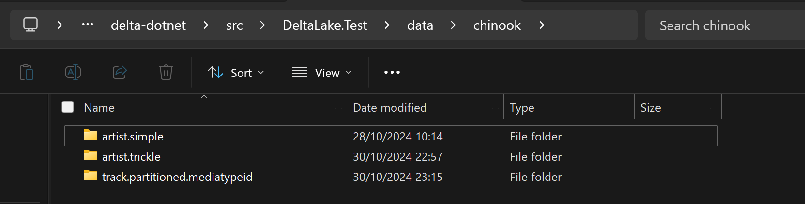

# Delta.IO [](https://www.nuget.org/packages/DeltaIO)


This is an ongoing attempt to implement [delta.io](https://delta.io/) in pure .net with no native dependencies, wrappers and so on.

## Why implement the Delta Lake transaction log protocol in .NET?

Delta Spark depends on Java and Spark, which is fine for many use cases, but not all Delta Lake users want to depend on these libraries. This library allows using Delta Lake in C# or other languages using .NET runtime.

It lets you query Delta tables with blazing speed without depending on Java/Scala.

Suppose you want to query a Delta table with on your local machine. This library makes it easy to query the table with a simple `dotnet add package` command - no need to install Java or Spark.

This library heavily relies on [parquet-dotnet](https://github.com/aloneguid/parquet-dotnet) - a fast, safe, pure parquet implementation in .NET, for reading delta log checkpoints and the data itself.

## Delta lake for idiots (like myself)

Delta lake essentially stores data as a set of parquet files. When you add a set of rows to the delta lake table, it essentially adds more parquet files. The problem is only to figure out which files to read.

Sometimes delta tables will be "compacted" to minimise the number of files and reorganise the storage for more efficiency, especially if those files are small and there are a lot of them.

When you *delete* rows from a delta lake table, some files will be deleted. But wait, what happens if you want to delete one row, and the file it's in contains other rows as well? In that case delta lake will mark the file as deleted, and create a new file without that row.

So the purpose of the delta lake library like this is to figure out which files are relevant.

Delta tables also support versioning, because files are kept for reasons of time travel. So that you can tell which files were relevant at specific point of time.

## Status

This library is almost at the stage where it can read delta tables. The aim of the first version is to fully support reading the lake, with next version to support modification operations as well. You can already use it for non-critical workloads today.

## Quick start

After installing the nuget package [](https://www.nuget.org/packages/DeltaIO), find out type of storage your tables are stored in. We will stick with local disk here, but there are plenty of other options. This library relies on [Stowage](https://github.com/aloneguid/stowage) library to abstract the locations of source files. Let's say I have three delta tables in `D:\delta-dotnet\src\DeltaLake.Test\data\chinook` folder, which looks like this:



```csharp
using DeltaLake;
using Stowage;

// point to location where delta table root is stored
IFileStorage location = Files.Of.LocalDiskStorage("D:/delta-dotnet/src/DeltaLake.Test/data/chinook");

// open "artist.simple" table
Table table = new Table(location, "artist.simple");
```

This will instantiate an interface to the delta table, so you can start performing other operations.

## Reading

To figure out which files are valid for current delta table, call the following method:

```csharp
IReadOnlyCollection<DataFile> dataFiles = await table.GetDataFilesAsync();
```

This returns the list of files at the *latest* version of this table. Each `DataFile` contains basic metadata about those data files, including it's size in bytes, partitions and their values, creation timestamp and, most importantly, path to the actual data in parquet format.

You can choose which files to read, and do the following:

```csharp
// let's open the first data file
using Stream parquetStream =
    await table.OpenSeekableStreamAsync(dataFiles.First());
```

Then read file data in any way you would normally do with [Parquet.Net](https://github.com/aloneguid/parquet-dotnet) library.

## Appending

Stay tuned!

## Deleting

Tune in!

## Contributing

Bookmark, star, start discussions, spread the word if you are interested in the future of this project! You can also donate to the project if you find it useful.

## Useful Links

- [Delta Transaction Log Protocol](https://github.com/delta-io/delta/blob/master/PROTOCOL.md).
- [Delta Kernel](https://docs.delta.io/latest/delta-kernel.html).
- [Integration Test Dataset](https://github.com/delta-io/delta-rs/tree/main/crates/test/tests/data).
- Alternative implementations
  - [delta-net](https://github.com/johnsusi/delta-net) - an early prototype as of late 2024.
  - [delta-dotnet](https://github.com/delta-incubator/delta-dotnet) - as of end of 2024 a promising incubator project, which is essentially a wrapper around [delta-rs](https://github.com/delta-io/delta-rs).
- [Chinook database](https://github.com/lerocha/chinook-database) used in generating test delta tables.
